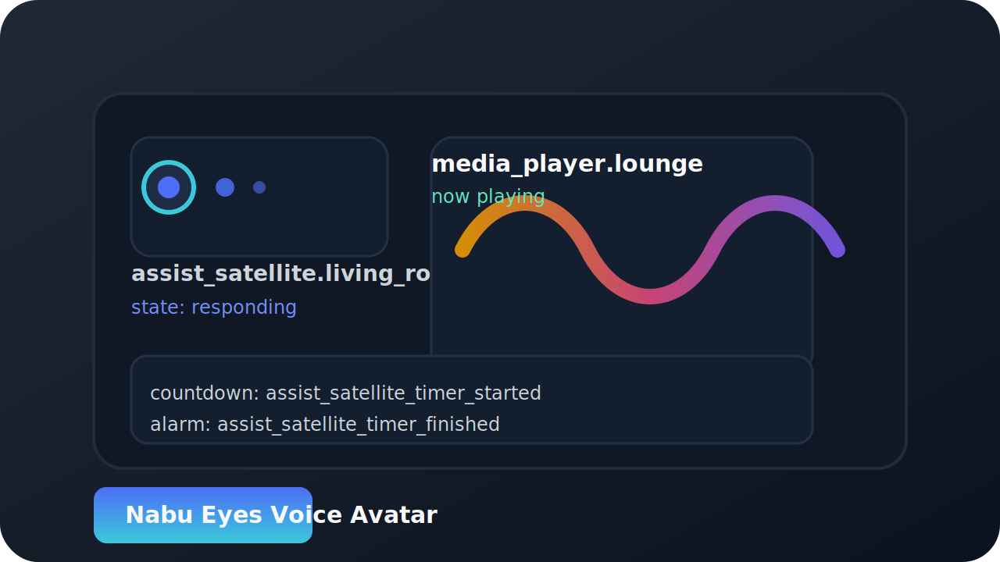

# nabu-eyes-voice-avatar
Voice Avatar for Home Assistant and Awtrix3 (Ulanzi Clock)



## Nabu Eyes Dashboard Card

The repository provides a Home Assistant Lovelace card that displays the animated Nabu Eyes
dashboard GIFs depending on the state of one or more Assist Satellite entities. The card also
supports media-player driven equalizer animations, mute overlays, and reacting to timer or alarm
events published on the Home Assistant event bus.

### Features

- Monitor multiple `assist_satellite` entities and switch the animation through the states `idle`,
  `listening`, `processing`, `responding`, and `playing`.
- Optional hiding of the card while every tracked satellite is idle.
- Media player integrations for equalizer animations and mute overlays.
- Subscribe to Home Assistant events to represent countdown or alarm activity.
- Alarm state can additionally follow binary entities such as doorbells or switches.
- GUI editor with support for selecting multiple satellites, alarm entities, and event lists.

### Installation

1. Install the card through HACS or copy the built file from `dist/nabu-eyes-dashboard-card.js` into
   your Home Assistant `www/` directory (typically `/config/www/`).
2. Copy the animated GIF assets from `src/assets/nabu_eyes_dashboard` into the same folder (for
   example `/config/www/nabu_eyes_dashboard`).
3. Add the resource reference to Home Assistant:

   ```yaml
   url: /local/nabu-eyes-dashboard-card.js
   type: module
   ```

### Example Lovelace Configuration

```yaml
type: custom:nabu-eyes-dashboard-card
name: Nabu Eyes
assist_entities:
  - assist_satellite.kitchen
  - assist_satellite.living_room
media_player: media_player.lounge
mute_media_player: media_player.lounge
alarm_entities:
  - binary_sensor.front_doorbell
asset_path: /local/nabu_eyes_dashboard
hide_when_idle: true
playing_variant: nabu_equalizer_dash.gif
media_player_equalizer: 2px_equalizer_fader_dash.gif
countdown_events:
  - assist_satellite_timer_started
countdown_clear_events:
  - assist_satellite_timer_cleared
alarm_events:
  - assist_satellite_timer_finished
alarm_clear_events:
  - assist_satellite_timer_cleared
```

### Configuration Options

- **assist_entities** (required): One or more Assist Satellite entities that drive the base
  animation state of the card. The card hides itself when every satellite reports `idle` if
  `hide_when_idle` is enabled.
- **hide_when_idle**: When `true`, the card disappears if all tracked satellites are idle. Set to
  `false` to always show the idle animation.
- **media_player**: Media player entity that controls the equalizer animation while it is playing.
- **mute_media_player**: Media player entity that controls the mute overlay. Defaults to the same
  entity as `media_player`.
- **asset_path**: Path to the folder (served from `/local`) that contains the GIF assets.
- **countdown_events** / **countdown_clear_events**: Home Assistant event types that toggle the
  countdown animation on or off.
- **alarm_events** / **alarm_clear_events**: Event types that toggle the alarm animation.
- **alarm_entities**: Binary entities (doorbells, switches, etc.) that can also activate the alarm
  animation when their state matches `alarm_active_states`.

### Development

Install dependencies and build the card with:

```bash
npm install
npm run build
```

The compiled file is emitted into the `dist/` directory alongside source maps for debugging.
